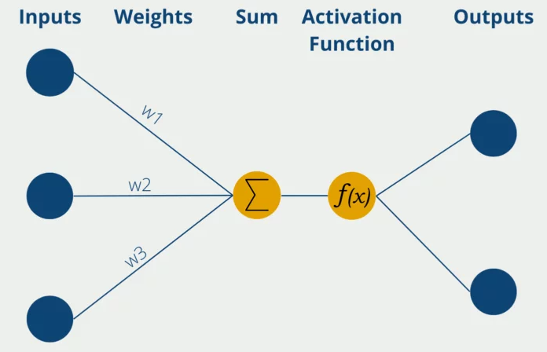

# ➡️Perceptron em C++ – Portas Lógicas OR e AND

Este repositório contém implementações em C++ de um perceptron de camada única, treinado para simular as portas lógicas OR e AND. O objetivo é entender, de forma prática e didática, como funciona o algoritmo de aprendizado do perceptron.

## 🔍O que é um Perceptron?

O perceptron é um modelo matemático inspirado no funcionamento dos neurônios biológicos, proposto por Frank Rosenblatt em 1958. Em um neurônio biológico, os dendritos recebem sinais elétricos de outros neurônios, processam esses sinais e, se a soma ultrapassar um determinado limiar, o neurônio "dispara" um impulso elétrico. Analogamente, o perceptron recebe múltiplas entradas, cada uma associada a um peso, calcula uma soma ponderada dessas entradas e aplica uma função de ativação para determinar a saída.
Matematicamente, o funcionamento de um perceptron pode ser descrito da seguinte forma:

1. **Entradas**: Um vetor de valores de entrada ($$x = [x_1, x_2, ..., x_n]$$).
2. **Pesos**: Cada entrada possui um peso associado ($$w = [w_1, w_2, ..., w_n]$$).
3. **Soma ponderada**: Calcula-se a soma ponderada das entradas e adiciona-se um viés ($b$ = bias):

$$
z = \sum_{i=1}^{n} w_i \cdot x_i + b
$$

4. **Função de ativação**: Aplica-se uma função de ativação à soma ponderada para determinar a saída do perceptron. No caso mais simples, utiliza-se a função degrau:

$$
f(z) = \begin{cases}
1, & \text{se } z \geq 0 \\
0, & \text{se } z < 0
\end{cases}
$$

  

🔄Durante o treinamento, os pesos e o viés são ajustados iterativamente com base no erro entre a saída prevista e a saída desejada, utilizando a seguinte regra de atualização:

$$
erro = d - y
$$

$$
w_i = w_i + \eta \cdot erro \cdot x_i
$$

$$
b = b + \eta \cdot erro
$$

Onde:
- $\eta$ : Taxa de aprendizado (learning rate).
- $d$ : Saída desejada.
- $y$: Saída prevista pelo perceptron.

Essa abordagem permite que o perceptron ajuste seus parâmetros para minimizar o erro de classificação em problemas onde os dados são **linearmente separáveis**.

## 📉Linearmente Separáveis
Antes de discutir a aplicação prática, é fundamental compreender o conceito de linearidade.

Uma relação é considerada linear quando pode ser representada por uma linha reta (em duas dimensões) ou por um hiperplano (em dimensões superiores). No contexto da classificação de padrões, afirma-se que um conjunto de dados é linearmente separável se for possível traçar uma linha (ou hiperplano) que divida perfeitamente as amostras de diferentes classes, sem ambiguidades ou erros.

### ✏️No caso do perceptron:
O perceptron simples é capaz de encontrar apenas soluções lineares. Durante o processo de treinamento, ele ajusta seus pesos com o objetivo de construir uma linha reta (ou hiperplano) que classifique corretamente todas as amostras.

Se os dados forem linearmente separáveis, o perceptron garante a convergência para uma solução capaz de distinguir perfeitamente as classes.

  

## 🛠️ Exemplos de Separação Linear: OR e AND
As operações lógicas OR e AND são exemplos clássicos de funções que podem ser resolvidas por um perceptron simples, pois seus dados são linearmente separáveis.

- OR: existe uma linha que separa as entradas que resultam em saída 0 daquelas que resultam em saída 1.

- AND: de maneira similar, é possível traçar uma linha para separar corretamente as classes.

  

## 📂 Organização dos Códigos
- or_perceptron.cpp → Implementação do perceptron treinado para a porta lógica OR.

- and_perceptron.cpp → Implementação do perceptron treinado para a porta lógica AND.

## 📚 Referências
- [Deep Learning Book Brasil - O Perceptron (Parte 2)](https://www.deeplearningbook.com.br/o-perceptron-parte-2/)
- [Wikipédia – Perceptron](https://pt.wikipedia.org/wiki/Perceptron)
